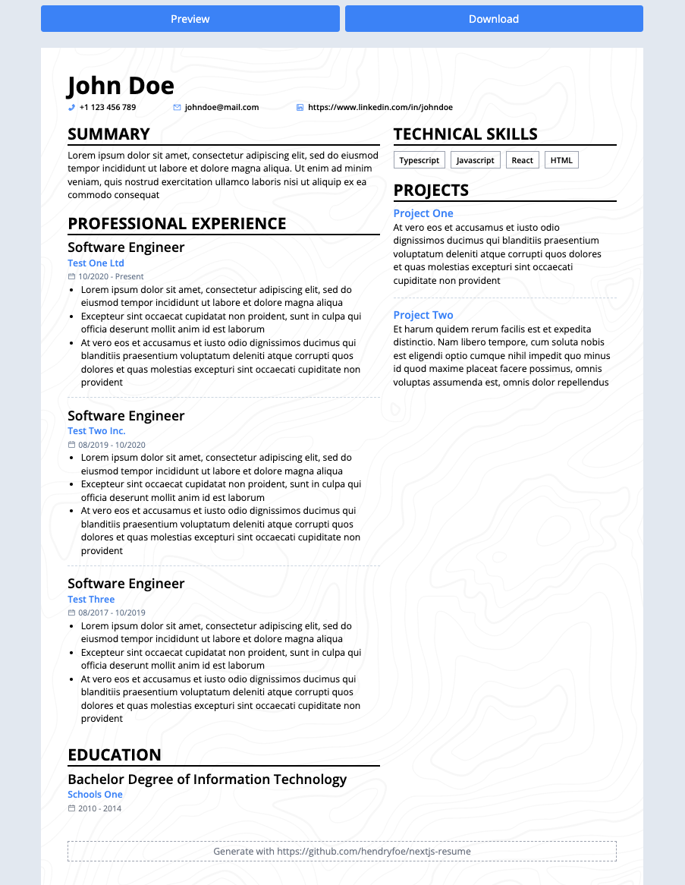

# Minimalist Resume

## Build with

- [NextJS](https://nextjs.org)
- [Tailwind](https://tailwindcss.com/)
- [zod](https://zod.dev/)
- [Puppeteer](https://pptr.dev/) + [Chrome AWS Lambda](https://github.com/alixaxel/chrome-aws-lambda)
- [pNpm](https://pnpm.io/)

---

## Getting Started

- Run `pnpm install` in the terminal
- Clone `.env.example` and rename to `.env.local`
- Clone `lib/data/.resume.example.json` and rename `.resume.example.json` to `resume.json` (without prefix `.`(dot))
- You can edit the content of `resume.json` to match with your resume
- Run `pnpm dev` in the terminal
- Open [http://localhost:3000](http://localhost:3000) with your browser to see the result.
- To preview real data in a resume, click `Preview` button and input the `password`
  - `password` must be same with `env.API_AUTHENTICATION_KEY`
- To generate `.pdf` file, click `Download` button and input the `password` or go to [http://localhost:3000/api/pdf](http://localhost:3000/api/pdf)
  - `password` must be same with `env.API_AUTHENTICATION_KEY`

There are 2 behaviors between `development` and `production`:

1. In `development`, Resume Content is generated from `resume.json`
2. In `production`, Resume Content is generated from `external resource API`<br />
   (e.g: from `gist.github.com` or your other secret API) and must be comply with [Resume Content Schema](#resume-content-schema)

---

## Resume Content Schema

Default schema is

```javascript
const schema = z.object({
  contact: z.object({
    firstName: z.string(),
    lastName: z.string(),
    phone: z.string(),
    email: z.string(),
    linkedin: z.string().optional(),
    github: z.string().optional(),
    summary: z.string()
  }),
  experiences: z.array(
    z.object({
      companyName: z.string(),
      companyWebsite: z.string(),
      title: z.string(),
      workingPeriod: z.string(),
      descriptions: z.array(z.string())
    })
  ),
  educations: z.array(z.object({ schoolName: z.string(), major: z.string(), year: z.string().optional() })).optional(),
  technicalSkills: z.array(z.string()),
  projects: z.array(z.object({ name: z.string(), description: z.string() })).optional()
});
```

## Deploy on Vercel

```bash
# [mandatory]
# Proteced `/api/pdf` endpoint
API_AUTHENTICATION_KEY=xxxx-xxxx-xxxx

# [optional]
# This obscures resume data to be shown
OBSCURE_KEYS=contact;experiences;educations;technicalSkills;projects

# [mandatory]
# - "NODE_ENV" is "production"
# - Resume Content will be filled based on the JSON response from this URL
# - Must comply with the schema
# - For free of charge, you can put the json on "gist.github.com", the example can be found in the ".env.example" file
RESUME_CONTENT_URL=http://test.com
```

---

## Preview


